# Architecture

## System boundary

The application is a single-machine desktop process with no backend, database, or runtime network request. PySide6 owns the UI and thread lifecycle; OpenCV decodes and transforms frames; ONNX Runtime performs depth inference; imageio-ffmpeg supplies a portable FFmpeg binary for normalization and final encoding.

## Runtime data flow

```mermaid
flowchart LR
    A["User video"] --> B["FFmpeg constant-FPS normalization"]
    B --> C["OpenCV frame decode"]
    C --> D["518x518 RGB normalization"]
    D --> E["Depth Anything V2 Small / ONNX Runtime CPU"]
    E --> F["Percentiles plus temporal EMA"]
    F --> G["Grayscale curve plus bilateral filter"]
    G --> H["Silent depth video"]
    H --> I["FFmpeg H.264 encode"]
    A -->|"optional source audio"| I
    I --> J["Complete temporary output"]
    J --> K["Move to destination MP4"]
```

## Module ownership

| Module | Owns | Must not own |
|---|---|---|
| `app.py` | Page composition, state transitions, worker lifetime, recent outputs | Frame algorithms and visual styling |
| `widgets.py` | Brand header, stage bar, drop target, results list | Video inference |
| `styles.py` | QSS, color, typography, spacing, widget-state styling | Business state |
| `depth_processor.py` | Probe, FFmpeg children, ONNX session, frame processing, cancellation | UI widgets |
| `DepthMotionStudio.spec` | Bundle resources, libraries, icon, and Info.plist | Runtime behavior |

## Thread model

- Main thread: Qt event loop, widget mutation, dialogs, and file pickers.
- Worker thread: `ProcessingWorker.run()` creates and runs one `DepthProcessor`.
- Progress: the worker emits `progress(int, str, object)` and Qt queues UI updates to the main thread.
- Cancellation: the main thread sets a `threading.Event`; the frame loop and FFmpeg polling both observe it.
- Shutdown: closing during work asks for confirmation, requests cancellation, and waits up to three seconds.

Never mutate a widget inside `ProcessingWorker`, and never move ONNX inference onto the main thread.

## Depth-frame pipeline

1. Convert BGR to RGB and resize to `518x518`.
2. Convert to float32 `[0,1]`, apply ImageNet mean/std, and transpose to NCHW.
3. Run ONNX inference and resize the result to the source dimensions.
4. Compute per-frame 1st/99th percentiles and smooth them with a `0.88/0.12` EMA to reduce flicker.
5. Normalize to `[0,1]`, apply gamma `0.82`, convert to 8-bit grayscale, and use a light bilateral filter.
6. Write a three-channel silent video before final H.264/audio encoding.

Depth polarity is part of the accepted model contract. Any model change must be checked with an obvious near/far test scene.

## UI state and persistence

The state sequence is `idle -> selected -> processing -> completed/error/cancelled`. `QSettings("Local Depth Tools", "Depth Motion Studio")` stores at most eight output paths. Startup drops paths that no longer exist. This is local UI state, not an application database.

## Design decisions

- Normalize FPS first to make progress and ETA deterministic across variable-frame-rate sources.
- Write to a temporary directory so cancellation or failure never leaves a false final artifact.
- Use `CPUExecutionProvider` as the stable baseline. Future CoreML/DirectML support must keep a CPU fallback.
- Use full-page scrolling because available screen height and Dock occupancy are not fixed.
